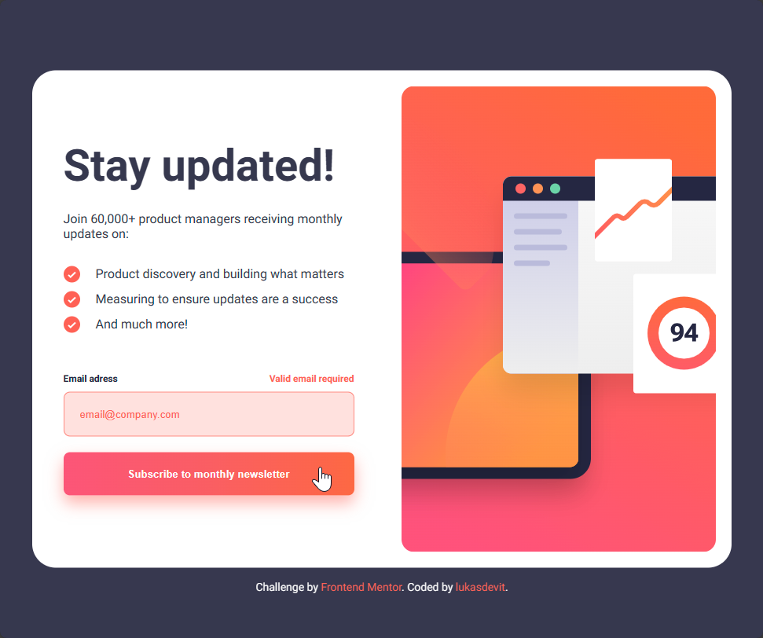

# Newsletter Sign-Up Form with Success Message

This repository contains my solution to the [Newsletter sign-up form with success message challenge](https://www.frontendmentor.io/challenges/newsletter-signup-form-with-success-message-3FC1AZbNrv) on Frontend Mentor. This challenge was a fantastic opportunity for me to enhance my coding skills by building a real-world project. 

## Table of contents

- [Overview](#overview)
  - [The challenge](#the-challenge)
  - [Screenshots](#screenshots)
  - [Links](#links)
- [My process](#my-process)
  - [Technologies Used](#built-with)
  - [Key Takeaways](#key-takeaways)
  - [Code Snippets](#code-snippets)
- [Useful resources](#useful-resources)
- [Author](#author)
- [Acknowledgments](#acknowledgments)

## Overview

### The challenge
In this challenge, I created a newsletter sign-up form with a success message that allows users to:

- Input their email and submit the form
- See a success message along with their email upon successful form submission
- Receive form validation messages in case of:
  - Leaving the field empty
  - Incorrectly formatted email address
- Experience a responsive design that adapts to various screen sizes
- Interact with hover and focus states for all interactive elements on the page

### Screenshots
| Desktop Design         | Active States          | Mobile Design           |
| ---------------------- | ---------------------- | ------------------------|
|  |  | 

### Links

- Solution URL: [GitHub Link](https://github.com/lukasdevit/newsletter-sign-up)
- Live Site URL: [Vercel Link](https://vercel.com/lukasdevit/newsletter-sign-up)

## My process

### Built with

- Semantic HTML5 markup
- CSS custom properties
- Flexbox
- [React](https://reactjs.org/) - JS library
- [Next.js](https://nextjs.org/) - React framework


### Key Takeaways
 Throughout this project, I gained valuable insights. For instance, I learned how to prevent form submission by using e.preventDefault() in a React component. Additionally, I discovered the power of the CSS order property for altering the order of elements in flexbox layouts, especially helpful for responsive design.

### Code Snippets
Here's a code snippet illustrating the use of e.preventDefault():
```html
<form onSubmit={e => (e.preventDefault())}>...</form>
```

And a CSS example of using the order property for responsive design:

```css
@media screen and (max-width: 123px)
.form-section {
  order: 2;
}
```

### Useful resources
I found the following resources particularly helpful during this project:

- [HTMLFormelement](https://developer.mozilla.org/en-US/docs/Web/API/HTMLFormElement) - This resource assisted me in implementing form validation, allowing me to verify user input and execute JavaScript code accordingly.
- [Gradient from color](https://color.adobe.com/pl/create/image-gradient) - Thanks to this tool, I could replicate the design with remarkable accuracy.

## Author
- Github - [lukasdevit](https://github.com/lukasdevit/newsletter-sign-up)
- Frontend Mentor - [@lukasdevit](https://www.frontendmentor.io/profile/lukasdevit)


## Acknowledgments

I extend my gratitude to [@zoedarkweather](https://www.frontendmentor.io/profile/zoedarkweather) for their valuable feedback and suggestions, which helped enhance the quality of my project.
